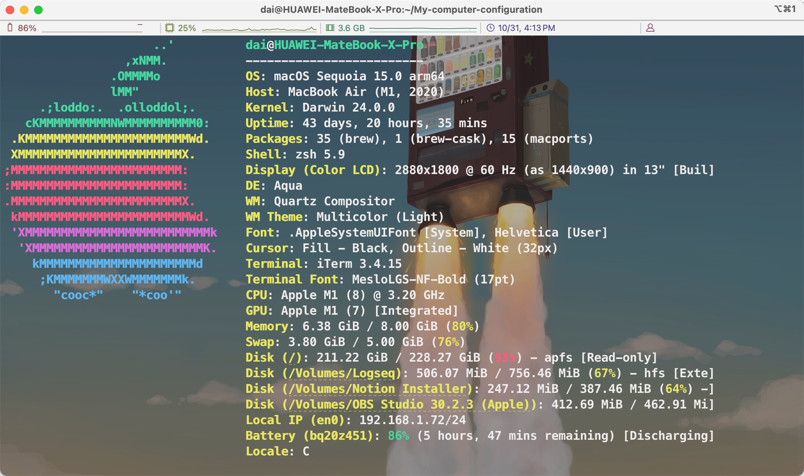

# My-computer-configuration

powered by [Josh Medeski's Dotfiles](https://github.com/joshmedeski/dotfiles)



This is the home of my dotfiles. These are files that add custom configurations to my computer and applications, primarily the terminal. It includes 2 versions for MacOS and Linux.

## ./dotdiles

- ✏️ Font: [Nerd Font](https://github.com/ryanoasis/nerd-fonts)
- 🥥 Shell: [oh-my-zsh](https://github.com/ohmyzsh/ohmyzsh)
- Shell theme: [powerlevel10k](https://github.com/romkatv/powerlevel10k)
- Bank Shell: [fish](https://fishshell.com)
- Multiplexer: [tmux](https://github.com/tmux/tmux/wiki)
- 🖥️ Terminal: [Iterms](https://iterm2.com/)
- Editor: [Neovim](https://neovim.io)
  - Configuration: [LazyVim](https://www.lazyvim.org/)
- macOS package manager: [Homebrew](https://brew.sh)
- keymaps files:

```lua
-- Keymaps are automatically loaded on the VeryLazy event
-- Default keymaps that are always set: https://github.com/LazyVim/LazyVim/blob/main/lua/lazyvim/config/keymaps.lua
-- Add any additional keymaps here
local keymap = vim.keymap
keymap.set("i", "ii", "<Esc>")
keymap.set("i", "<C-w>", "<C-o>w", { noremap = true, silent = true })
-- 移动到单词开头并在单词前进入插入模式
vim.keymap.set("i", "<C-b>", "<Esc>bi", { noremap = true, silent = true })

-- 移动到单词末尾并使用 append 进入插入模式
vim.keymap.set("i", "<C-f>", "<Esc>ea", { noremap = true, silent = true }) --
---
---方向键
---
keymap.set("i", "<C-l>", "<Right>", { noremap = true, silent = true })
keymap.set("i", "<C-h>", "<Left>", { noremap = true, silent = true })
keymap.set("i", "<C-j>", "<Down>", { noremap = true, silent = true })
keymap.set("i", "<C-k>", "<Up>", { noremap = true, silent = true })
keymap.set("i", "<C-a>", "<C-o>^", { noremap = true, silent = true }) -- 移动到行首
keymap.set("i", "<C-e>", "<C-o>$", { noremap = true, silent = true }) -- 移动到行尾
keymap.set("i", "<C-z>", "<C-o>u", { noremap = true, silent = true }) --撤销上次操作
```

---

## Software

- remote shell apps: [termius](https://termius.com/)

- Linux package manager:
  - Ubuntu: [Debain apt](https://github.com/Debian/apt)
  - Arch Linux: [packman]()
- Video player:
  - Windows: [potplayer](https://potplayer.daum.net/)
  - MacOS: [movist pro](https://movistprime.com/)
  - Linux:
- NoteBook
  - Online: [notion](https://www.notion.so/)
  - Knowledge: [Obsidian](https://obsidian.md/)
  - Markdown: [typora](https://typora.io/)
  - Editor: [coteditor](https://coteditor.com/)
- PDF reader: [pdf expert](https://pdfexpert.com/)
- Paper reader: [zetore 7](https://www.zotero.org/)
- Knowledge map: [xmind](https://xmind.app/)
- Web Browser: [chrome](https://www.google.com/intl/en_us/chrome/)
- Downloader: [Motrix](https://motrix.app/download)
- Screenshot: [snipaste](https://www.snipaste.com/)
- Calendar: [Notion Calendar](https://calendar.notion.so/)

## Embed Softwares

### development

- C kits:
  - compiler: [gcc/g++](https://gcc.gnu.org/)
  - debuger: [gdb](https://www.gnu.org/savannah-checkouts/gnu/gdb/index.html)
  - package: [make](https://www.gnu.org/software/make/)
  - package: [CMake](https://cmake.org/)
- Java:
  - compiler: [oracle-jdk](oracle.com/java/technologies/downloads/)
  - Virtual Machine: [graalvm](https://www.graalvm.org/downloads/)
- Python:
  - [compiler](https://www.python.org/)
  - manager:
    - [anaconda](https://www.anaconda.com/)
    - [Pypi](https://pypi.org/)
    - [pipx](https://pipx.pypa.io/stable/)

## Hardware

- Laptop1: [MacBook Air](https://www.apple.com/macbook-air/) (13-inch, 2021, Apple M1 Chip, 8GB RAM, 256GB ROM)
- Laptop2: [Lenovo Legion R9000P](https://www.lenovo.com/us/en/legion/)(16-inch, 2021, R7-5800H, 32GB RAM, 1.5TB ROM (sumsang sm961 500G, sumsang pm981a 1TB))
- Pad: [Apple ipad pro 13](https://www.apple.com/ipad-pro/)(13-inch, 2024, Apple M4 Chip, 8GB RAM, 256GB ROM)
- Mouse:
  - [Razer Viper 2 Pro](https://www.razer.com/gaming-mice/razer-viper-v2-pro)(PWM 3950 sensor)
  - [MCHOS AX5](https://www.maicong.cn/product/AX5/60)(PWM 3395 sensor)

## Keyboards

- [MCHOSE G75 v2](https://www.maicong.cn/product/G75/72)

## Power charger

- [CUKTECH GAN 30W transparent version](https://cuktech.com/collections/adaptor/products/a03-cuktech-30w-gan3-charger)

## Earphone

- [Apple airpods pro](https://www.apple.com/airpods-pro/)
- [dunu dk3001pro](https://soundearth.jp/dk3001pro/)

## Headphone

- [Hifiman ananda](https://hifiman.com/products/detail/317)
- [ATH-R70x](https://www.audio-technica.co.jp/product/ATH-R70x)
